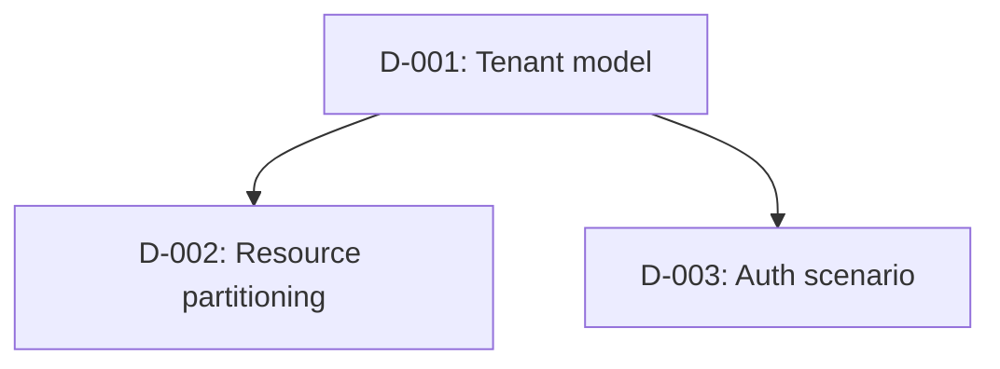

# Implementation Plan (Phase 3 Output)

Produced after Phase 1 (domain definition) and Phase 2 (resource mapping) are complete. This is the bridge between design and code.

**Create this file as `.scaffold/implementation-plan.md` in the target project (create the `.scaffold/` directory at project root if absent).**

Checkpoint commands and pass criteria are canonical in [../support/execution-gates.md](../support/execution-gates.md).

## Template

```markdown
# Implementation Plan - {{ProjectName}}

## Inputs Summary

- Domain specification: `.scaffold/domain-specification.yaml`
- Resource mapping: `.scaffold/resource-implementation.yaml`
- Ubiquitous language: `.scaffold/UBIQUITOUS-LANGUAGE.md`
- Design decisions: `.scaffold/DESIGN-DECISIONS.md`
- Mode: {{scaffoldMode}} | Testing: {{testingProfile}}
- Enabled hosts: {{list}}

## Implementation Steps

### Phase 4 - Contract Scaffolding
- [ ] Solution structure (.slnx, Directory.Packages.props, global.json, nuget.config)
- [ ] All project files with correct references
- [ ] Interfaces: I{Entity}Service, I{Entity}RepositoryTrxn, I{Entity}RepositoryQuery (per entity)
- [ ] DTOs: {Entity}Dto, {Entity}SearchFilter (per entity)
- [ ] Entity shells (properties + constructors, no domain logic)
- [ ] Test infrastructure (Test.Support, builders, CustomApiFactory)
- [ ] No-op DI stubs in RegisterServices.cs
- [ ] **Checkpoint:** `dotnet build` succeeds on full solution including test projects

### Phase 5a - Foundation (TDD)
- [ ] Write domain entity tests (red) -> implement entity logic (green)
- [ ] Write domain rule tests (red) -> implement rules (green)
- [ ] Write repository tests (red) -> implement EF configs + repositories (green)
- [ ] Activate {Entity}Builder.Build() with real entity Create()
- [ ] Replace no-op repository stubs with real implementations
- [ ] Scaffold EF migration
- [ ] **Checkpoint:** `dotnet build` + `dotnet test --filter "TestCategory=Unit"` passes

### Phase 5b - App Core + Runtime/Edge (TDD for app/API, tests-after for runtime)
- [ ] Write service unit tests (red) -> implement services + mappers + validators (green)
- [ ] Write endpoint integration tests (red) -> implement endpoints (green)
- [ ] Replace no-op service stubs with real implementations
- [ ] Message handlers (if events defined)
- [ ] Bootstrapper DI wiring finalized
- [ ] Runtime/edge concerns (tests-after): gateway (if enabled), Aspire orchestration (if enabled), configuration + appsettings, multi-tenant middleware (if enabled), caching (if enabled), observability, security
- [ ] Write infrastructure tests (health checks, config loading, caching) - place mock-based tests in `Test.Unit` (`TestCategory=Unit`) and WAF-based tests in `Test.Endpoints` (`TestCategory=Endpoint`); real-DB integration tests are deferred to Phase 5d
- [ ] **Checkpoint:** `dotnet build` + `dotnet test --filter "TestCategory=Unit|TestCategory=Endpoint"` passes; app starts via Aspire (when enabled)

### Phase 5c - Optional Hosts (Tests-After)
- [ ] Background services / scheduler (if enabled)
- [ ] Function app (if enabled)
- [ ] Uno UI (if enabled; dedicated session preferred)
- [ ] Blazor UI (if enabled)
- [ ] React UI (if enabled)
- [ ] Notifications (if enabled)
- [ ] Write per-host smoke tests
- [ ] **Checkpoint:** `dotnet build`, each enabled host responds, `dotnet test` passes; per-host gate status recorded in `HANDOFF.md`

### Phase 5d - Quality + Delivery
- [ ] Service-level Integration tests against real external services (Testcontainers SQL, real cache) - `Test.Integration`, `TestCategory=Integration` (balanced + comprehensive profiles)
- [ ] Multi-endpoint E2E workflow tests against Testcontainers SQL - `Test.E2E`, `TestCategory=E2E` (comprehensive profile)
- [ ] Architecture tests (NetArchTest layering rules)
- [ ] Load tests (if comprehensive profile)
- [ ] Benchmarks (if comprehensive profile)
- [ ] Browser UI Playwright tests against hosted stack (if comprehensive profile + UI enabled) - `Test.PlaywrightUI`, C# MSTest + `Microsoft.Playwright.MSTest`
- [ ] IaC templates (Bicep)
- [ ] CI/CD pipeline
- [ ] Dockerfile
- [ ] Vulnerability audit (`dotnet list package --vulnerable --include-transitive`)
- [ ] Full regression: `dotnet test` (all categories)
- [ ] **Checkpoint:** full test suite passes; `az bicep build` succeeds (if IaC enabled)

### Phase 5e - Integration (Auth + AI)

**Authentication finalization:**
- [ ] Prompt for identity provider scenario (see options below)
- [ ] Replace auth stubs with real identity configuration (config-driven scaffold principal as default)
- [ ] Wire auth middleware, token validation, and role/scope checks
- [ ] Update appsettings with provider-specific configuration
- [ ] **Checkpoint:** authenticated endpoints respond correctly under `AuthMode` toggle

**Identity Provider Options:**
- **Enterprise / internal users:** Microsoft Entra ID - SSO, conditional access, group-based roles
- **External / consumer users:** Microsoft Entra External ID, Google, Facebook, Apple, OAuth2/OIDC
- **Hybrid:** Entra ID for internal + Entra External ID or social providers for external users

**AI integration (when `includeAiServices: true`):**
- [ ] `Infrastructure.AI` project with search/agent service interfaces
- [ ] Azure AI Search index definitions + client wiring (if search configured)
- [ ] Embedding pipeline: on-write handler (domain event -> vectorize -> index) or batch job
- [ ] Agent service scaffolding (Microsoft Agent Framework `ChatClientAgent` / `FoundryAgent`)
- [ ] Agent function tools wrapping existing `I{Entity}Service` domain operations
- [ ] Agent middleware (logging, auth context propagation, content safety)
- [ ] Multi-agent workflow with executors + edges (if `workflow.enabled: true`)
- [ ] Aspire resource wiring (`AddAzureAISearch()`, `AddAzureOpenAI()`)
- [ ] Bootstrapper DI registration for AI services
- [ ] API endpoints for search + agent interactions
- [ ] Configuration: Foundry endpoint, model deployment names, search index names in appsettings
- [ ] **Checkpoint:** AI service interfaces compile and resolve from DI; if live endpoints provisioned, search returns results and agent responds to test prompt

## Open Questions

Resolve before Phase 5 starts:

1. _[list any unresolved design decisions]_
2. _[ambiguous requirements]_
3. _[external dependency unknowns]_

## Decision Dependency Graph

Keep this aligned with `.scaffold/DESIGN-DECISIONS.md`. Include every decision that affects code generation order, resource mapping, auth, external dependency mode, or endpoint contracts.



## Decisions Log

| # | Decision | Rationale |
|---|---|---|
| 1 | _e.g., SQL for Orders, CosmosDB for ActivityLog_ | _Relational joins needed for Orders; ActivityLog is append-only_ |

## Tooling & Environment Readiness

Populated during Phase 3 by analyzing `.scaffold/resource-implementation.yaml` technology choices. The AI researches available CLIs, MCP servers, and online resources, then records findings here.

**Preference order: CLI -> MCP -> online resources.** CLIs are most token-efficient with structured output. MCP servers add value for interactive exploration (docs, repos) when no CLI exists. When neither is available, record documentation URLs and GitHub repos the AI can fetch during later phases.

### Required CLIs

| Tool | Needed for | Phase | Install | Verified |
|---|---|---|---|---|
| `dotnet-ef` | EF migrations | 5a | Prefer repo-local: `dotnet new tool-manifest` then `dotnet tool install dotnet-ef`; user-global `dotnet tool install -g dotnet-ef` is acceptable | [ ] |
| _e.g., `func`_ | _Azure Functions host_ | _5c_ | _`npm i -g azure-functions-core-tools@4`_ | _[ ]_ |
| _e.g., `azd`_ | _IaC deployment/dry-run packaging_ | _5d_ | _`winget install Microsoft.Azd`_ | _[ ]_ |
| _e.g., `uno-check`_ | _Uno workload validation_ | _5c_ | _`dotnet tool install -g uno.check`_ | _[ ]_ |
| _e.g., `wasm-tools` workload_ | _Uno browserwasm build_ | _5c_ | _`dotnet workload install wasm-tools`_ | _[ ]_ |
| _e.g., `.NET Android workload`_ | _Uno Android build/emulator test_ | _5c/5d_ | _`dotnet workload install android`_ | _[ ]_ |
| _e.g., `Android SDK / emulator`_ | _Uno Android device smoke tests_ | _5d_ | _Install Android Studio or SDK command-line tools with Platform-Tools, Emulator, one recent platform, and one AVD_ | _[ ]_ |
| _e.g., `.NET iOS workload`_ | _Uno iOS compile gate or macOS CI_ | _5c/5d_ | _`dotnet workload install ios`; simulator/device UI tests require macOS_ | _[ ]_ |
| _e.g., `node` / `npm`_ | _React/Vite UI build and Playwright_ | _5c/5d_ | _Install current Node.js LTS_ | _[ ]_ |

### Shared Base-Type Readiness

The required checklist depends on `packageStrategy` from `.scaffold/resource-implementation.yaml`. Run the appropriate block.

#### When `packageStrategy: feed` or `hybrid`

Feed-supplied layers must restore cleanly before Phase 4. Required:

- [ ] `nuget.config` contains `nuget.org`.
- [ ] `nuget.config` contains every `customNugetFeeds` entry from `.scaffold/resource-implementation.yaml`.
- [ ] `packageSourceMapping` maps `<packagePrefix>.*` to the private feed.
- [ ] `packageSourceMapping` maps `dotnet-ef` or `*` to `nuget.org`.
- [ ] Local developer has package read access exposed through `NUGET_AUTH_TOKEN` or an approved credential provider.
- [ ] `Directory.Packages.props` owns all `<packagePrefix>.*` package versions for feed-supplied layers.
- [ ] Project-level `<PackageReference Include="<packagePrefix>.*">` entries have no `Version` attribute.
- [ ] No shared base type generated locally **for layers the feed supplies**.

#### When `packageStrategy: local` or `hybrid`

Locally-generated layers (from `localPackageLayers`) must scaffold under `src/Packages/`. Required:

- [ ] `packagePrefix` is set in `.scaffold/resource-implementation.yaml`.
- [ ] Phase 4 will generate one packable project per entry in `localPackageLayers`, e.g., `src/Packages/<packagePrefix>.Domain`, `.Domain.Contracts`, `.Data`, `.Data.Contracts`, `.Common`, `.Common.Contracts` (per [`../support/ef-packages-reference.md`](../support/ef-packages-reference.md)).
- [ ] Each packable project sets `IsPackable=true`, `<PackageId>=<packagePrefix>.<Layer>`, default version `0.1.0`.
- [ ] Application/domain/host projects consume these via `<ProjectReference>` (no `Version` attribute, no `Directory.Packages.props` entry needed).
- [ ] When `hybrid`: locally-generated layers use the **same** `packagePrefix` as the feed so they can be published into the feed later without renaming.

Validation (both modes):

```powershell
dotnet restore
```

After Phase 4 creates projects, re-run `dotnet restore` to confirm all `<packagePrefix>.*` references - package or project - resolve cleanly.

### Recommended MCP Servers

| Server | Phases | Why | Available |
|---|---|---|---|
| _e.g., Azure MCP_ | _5d, 5e_ | _IaC validation, resource checks_ | _[ ]_ |
| _e.g., Playwright MCP_ | _5d_ | _Hosted browser test debugging_ | _[ ]_ |

### Online Resources

For libraries/services with no CLI or MCP server, record documentation and repo URLs the AI can fetch during implementation.

| Library/Service | Phase | Resource | URL |
|---|---|---|---|
| _e.g., FusionCache_ | _5b_ | _GitHub repo + wiki_ | _`https://github.com/ZiggyCreatures/FusionCache`_ |
| _e.g., TickerQ_ | _5c_ | _NuGet readme + samples_ | _`https://github.com/user/TickerQ`_ |
| _e.g., NetArchTest_ | _5d_ | _GitHub README_ | _`https://github.com/BenMorris/NetArchTest`_ |

### Discovery Notes

_During Phase 3, search for CLIs, MCP servers, and online resources matching project-specific libraries/services (npm `mcp + <library>`, MCP registry, GitHub, official docs). Record findings using three-tier preference: CLI -> MCP -> online resources._

- _e.g., FusionCache - no CLI or MCP; GitHub wiki added to Online Resources_
- _e.g., TickerQ - no CLI or MCP; NuGet readme added to Online Resources_
- _e.g., YARP - no dedicated MCP; Microsoft Docs MCP covers it via `microsoft_docs_search`_

## Risk / Blockers

| Risk | Mitigation |
|---|---|
| _e.g., Private NuGet feed access (`feed`/`hybrid` only)_ | _Engineer to configure feed auth before Phase 4. If access is blocked at scaffold time, switch to `local` for affected layers and capture them in `localPackageLayers`._ |
| _e.g., Locally-generated base contracts diverge from `support/ef-packages-reference.md`_ | _Generate strictly from the reference file; do not invent additional members. Re-verify type signatures against the file before Phase 5a._ |
```

## Usage

1. AI fills in the template based on Phase 1 + Phase 2 outputs
2. Human reviews, resolves open questions, confirms decisions
3. Phase 5 implementation follows the step order above
4. Check off items as completed during implementation

---

## Phase 3 -> 4 Pre-Flight

Before starting Phase 4 (contract scaffolding), verify all of the following:

- [ ] `nuget.config` validated (`dotnet restore` exits 0) - applies in `feed` and `hybrid`; in `local`, `nuget.config` only needs `nuget.org`
- [ ] All open questions resolved or explicitly deferred with TODO
- [ ] `scaffoldMode`, `testingProfile`, and all host flags confirmed
- [ ] `packageStrategy`, `packagePrefix`, `customNugetFeeds`, and `localPackageLayers` confirmed in `.scaffold/resource-implementation.yaml`
- [ ] If `feed`/`hybrid`: NuGet feed helper run or manually verified (`configure-ef-packages-feed.py --prefix <packagePrefix>`); `NUGET_AUTH_TOKEN` set; `dotnet restore` exits 0
- [ ] If `local`/`hybrid`: every layer in `localPackageLayers` matches a layer in [`../support/ef-packages-reference.md`](../support/ef-packages-reference.md); Phase 4 will generate `src/Packages/<packagePrefix>.<Layer>` packable projects for each
- [ ] Developer reviews `.scaffold/implementation-plan.md` against `ai/implementation-plan.md` schema
- [ ] Domain specification and resource implementation YAML files are complete
- [ ] `.scaffold/UBIQUITOUS-LANGUAGE.md` and `.scaffold/DESIGN-DECISIONS.md` exist and match the domain/resource artifacts
- [ ] Decision Dependency Graph is populated and has no unresolved blockers for Phase 4
- [ ] Tooling & Environment Readiness section populated (CLIs identified, MCP discovery complete)
- [ ] All required CLIs verified or install commands provided
- [ ] Implementation plan reviewed and approved by human

## Application Style

Phase 2/3 plans must name `applicationStyle: service | cqrs | switch` before project scaffolding. `service` uses the standard `I{Entity}Service` implementation path. `cqrs` adds request records, focused handlers, decorated handler registration, custom validators, and CQRS endpoint classes while keeping DTO contracts and routes stable. `switch` generates both endpoint sets and validates `Application:Style=Service` and `Application:Style=Cqrs`.
