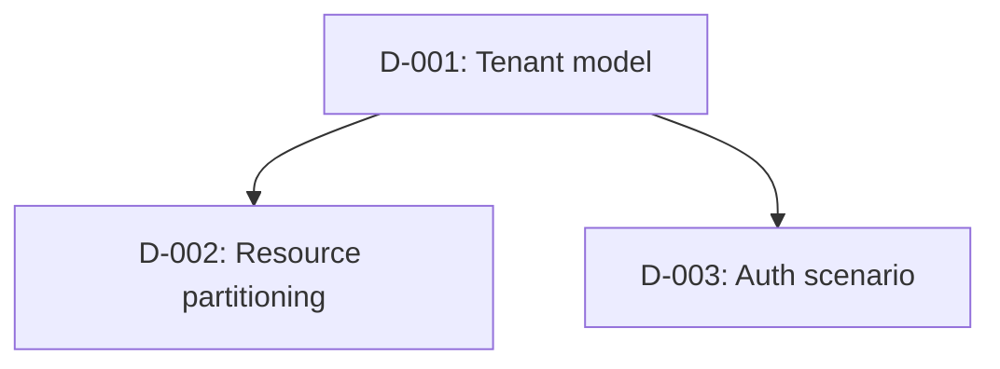

# Implementation Plan (Phase 3 Output)

Produced after Phase 1 (domain definition) and Phase 2 (resource mapping) are complete. This is the bridge between design and code.

**Create this file in the target project root as `implementation-plan.md`.**

Checkpoint commands and pass criteria are canonical in [../support/execution-gates.md](../support/execution-gates.md).

## Template

```markdown
# Implementation Plan — {{ProjectName}}

## Inputs Summary

- Domain specification: `domain-specification.yaml` (project root; or `.instructions/domain-specification.yaml` if repo adopts that convention)
- Resource mapping: `resource-implementation.yaml` (project root; or `.instructions/resource-implementation.yaml` if repo adopts that convention)
- Ubiquitous language: `UBIQUITOUS-LANGUAGE.md`
- Design decisions: `DESIGN-DECISIONS.md`
- Mode: {{scaffoldMode}} | Testing: {{testingProfile}}
- Enabled hosts: {{list}}

## Implementation Steps

### Phase 4 — Contract Scaffolding
- [ ] Solution structure (.slnx, Directory.Packages.props, global.json, nuget.config)
- [ ] All project files with correct references
- [ ] Interfaces: I{Entity}Service, I{Entity}RepositoryTrxn, I{Entity}RepositoryQuery (per entity)
- [ ] DTOs: {Entity}Dto, {Entity}SearchFilter (per entity)
- [ ] Entity shells (properties + constructors, no domain logic)
- [ ] Test infrastructure (Test.Support, builders, CustomApiFactory)
- [ ] No-op DI stubs in RegisterServices.cs
- [ ] **Checkpoint:** `dotnet build` succeeds on full solution including test projects

### Phase 5a — Foundation (TDD)
- [ ] Write domain entity tests (red) → implement entity logic (green)
- [ ] Write domain rule tests (red) → implement rules (green)
- [ ] Write repository tests (red) → implement EF configs + repositories (green)
- [ ] Activate {Entity}Builder.Build() with real entity Create()
- [ ] Replace no-op repository stubs with real implementations
- [ ] Scaffold EF migration
- [ ] **Checkpoint:** `dotnet build` + `dotnet test --filter "TestCategory=Unit"` passes

### Phase 5b — App Core (TDD)
- [ ] Write service unit tests (red) → implement services + mappers + validators (green)
- [ ] Write endpoint integration tests (red) → implement endpoints (green)
- [ ] Replace no-op service stubs with real implementations
- [ ] Message handlers (if events defined)
- [ ] Bootstrapper DI wiring finalized
- [ ] **Checkpoint:** `dotnet build` + `dotnet test --filter "TestCategory=Unit|TestCategory=Endpoint"` passes

### Phase 5c — Runtime/Edge (Tests-After)
- [ ] Gateway (if enabled)
- [ ] Aspire orchestration (if enabled)
- [ ] Configuration + appsettings
- [ ] Multi-tenant middleware (if enabled)
- [ ] Caching (if enabled)
- [ ] Write infrastructure tests (health checks, config loading, caching)
- [ ] **Checkpoint:** app starts via Aspire, `dotnet test` passes

### Phase 5d — Optional Hosts (Tests-After)
- [ ] Background services / scheduler (if enabled)
- [ ] Function app (if enabled)
- [ ] Uno UI (if enabled; dedicated session preferred)
- [ ] Notifications (if enabled)
- [ ] Write per-host smoke tests
- [ ] **Checkpoint:** `dotnet build`, optional host responds, `dotnet test` passes

### Phase 5e — Quality Gates + Delivery
- [ ] Architecture tests (NetArchTest layering rules)
- [ ] Load tests (if comprehensive profile)
- [ ] Benchmarks (if comprehensive profile)
- [ ] IaC templates
- [ ] CI/CD pipeline
- [ ] Dockerfile
- [ ] Full regression: `dotnet test` (all categories)
- [ ] **Checkpoint:** full test suite passes

### Phase 5f — Authentication (Final)
- [ ] Prompt for identity provider scenario (see options below)
- [ ] Replace auth stubs with real identity configuration
- [ ] Wire auth middleware, token validation, and role/scope checks
- [ ] Update appsettings with provider-specific configuration
- [ ] **Checkpoint:** authenticated endpoints respond correctly

**Identity Provider Options:**
- **Enterprise / internal users:** Microsoft Entra ID — SSO, conditional access, group-based roles
- **External / consumer users:** Microsoft Entra External ID, Google, Facebook, Apple, OAuth2/OIDC
- **Hybrid:** Entra ID for internal + Entra External ID or social providers for external users

### Phase 5g — AI Integration (if `includeAiServices: true`)
- [ ] `Infrastructure.AI` project with search/agent service interfaces
- [ ] Azure AI Search index definitions + client wiring (if search configured)
- [ ] Embedding pipeline: on-write handler (domain event → vectorize → index) or batch job
- [ ] Agent service scaffolding (Microsoft Agent Framework `ChatClientAgent` / `FoundryAgent`)
- [ ] Agent function tools wrapping existing `I{Entity}Service` domain operations
- [ ] Agent middleware (logging, auth context propagation, content safety)
- [ ] Multi-agent workflow with executors + edges (if `workflow.enabled: true`)
- [ ] Aspire resource wiring (`AddAzureAISearch()`, `AddAzureOpenAI()`)
- [ ] Bootstrapper DI registration for AI services
- [ ] API endpoints for search + agent interactions
- [ ] Configuration: Foundry endpoint, model deployment names, search index names in appsettings
- [ ] **Checkpoint:** search returns results, agent responds to test prompt

## Open Questions

Resolve before Phase 5 starts:

1. _[list any unresolved design decisions]_
2. _[ambiguous requirements]_
3. _[external dependency unknowns]_

## Decision Dependency Graph

Keep this aligned with `DESIGN-DECISIONS.md`. Include every decision that affects code generation order, resource mapping, auth, external dependency mode, or endpoint contracts.



## Decisions Log

| # | Decision | Rationale |
|---|---|---|
| 1 | _e.g., SQL for Orders, CosmosDB for ActivityLog_ | _Relational joins needed for Orders; ActivityLog is append-only_ |

## Tooling & Environment Readiness

Populated during Phase 3 by analyzing `resource-implementation.yaml` technology choices. The AI researches available CLIs, MCP servers, and online resources, then records findings here.

**Preference order: CLI → MCP → online resources.** CLIs are most token-efficient with structured output. MCP servers add value for interactive exploration (docs, repos) when no CLI exists. When neither is available, record documentation URLs and GitHub repos the AI can fetch during later phases.

### Required CLIs

| Tool | Needed for | Phase | Install | Verified |
|---|---|---|---|---|
| `dotnet-ef` | EF migrations | 5a | `dotnet tool install dotnet-ef` | [ ] |
| _e.g., `func`_ | _Azure Functions host_ | _5d_ | _`npm i -g azure-functions-core-tools@4`_ | _[ ]_ |
| _e.g., `azd`_ | _IaC deployment_ | _5e_ | _`winget install Microsoft.Azd`_ | _[ ]_ |
| _e.g., `uno-check`_ | _Uno workload validation_ | _5d_ | _`dotnet tool install -g uno.check`_ | _[ ]_ |

### EF.Packages Feed Readiness

Required before Phase 4:

- [ ] `nuget.config` contains `nuget.org`.
- [ ] `nuget.config` contains every `customNugetFeeds` entry from `resource-implementation.yaml`.
- [ ] `packageSourceMapping` maps `EF.*` to the private feed.
- [ ] `packageSourceMapping` maps `dotnet-ef` or `*` to `nuget.org`.
- [ ] Local developer has a GitHub PAT with package read access exposed through `NUGET_AUTH_TOKEN` or an approved credential provider.
- [ ] `Directory.Packages.props` owns all `EF.*` package versions.
- [ ] Project-level `EF.*` `<PackageReference>` entries have no `Version` attribute.
- [ ] No EF.Packages shared type is generated locally.

Validation:

```powershell
python .instructions/scripts/validate-ef-packages-feed.py --root . --config-only --require-auth-env
```

After Phase 4 creates projects:

```powershell
python .instructions/scripts/validate-ef-packages-feed.py --root .
```

### Recommended MCP Servers

| Server | Phases | Why | Available |
|---|---|---|---|
| _e.g., Azure MCP_ | _5c, 5e_ | _IaC validation, resource checks_ | _[ ]_ |
| _e.g., Playwright MCP_ | _5e_ | _E2E test debugging_ | _[ ]_ |

### Online Resources

For libraries/services with no CLI or MCP server, record documentation and repo URLs the AI can fetch during implementation.

| Library/Service | Phase | Resource | URL |
|---|---|---|---|
| _e.g., FusionCache_ | _5c_ | _GitHub repo + wiki_ | _`https://github.com/ZiggyCreatures/FusionCache`_ |
| _e.g., TickerQ_ | _5d_ | _NuGet readme + samples_ | _`https://github.com/user/TickerQ`_ |
| _e.g., NetArchTest_ | _5e_ | _GitHub README_ | _`https://github.com/BenMorris/NetArchTest`_ |

### Discovery Notes

_During Phase 3, search for CLIs, MCP servers, and online resources matching project-specific libraries/services (npm `mcp + <library>`, MCP registry, GitHub, official docs). Record findings using three-tier preference: CLI → MCP → online resources._

- _e.g., FusionCache — no CLI or MCP; GitHub wiki added to Online Resources_
- _e.g., TickerQ — no CLI or MCP; NuGet readme added to Online Resources_
- _e.g., YARP — no dedicated MCP; Microsoft Docs MCP covers it via `microsoft_docs_search`_

## Risk / Blockers

| Risk | Mitigation |
|---|---|
| _e.g., Private NuGet feed access_ | _Engineer to configure feed auth before Phase 4_ |
```

## Usage

1. AI fills in the template based on Phase 1 + Phase 2 outputs
2. Human reviews, resolves open questions, confirms decisions
3. Phase 5 implementation follows the step order above
4. Check off items as completed during implementation

---

## Phase 3 → 4 Pre-Flight

Before starting Phase 4 (contract scaffolding), verify all of the following:

- [ ] `nuget.config` validated (`dotnet restore` exits 0)
- [ ] All open questions resolved or explicitly deferred with TODO
- [ ] `scaffoldMode`, `testingProfile`, and all host flags confirmed
- [ ] Custom NuGet feed URLs and auth configured (if any)
- [ ] EF.Packages feed helper run or manually verified (`configure-ef-packages-feed.py`)
- [ ] EF.Packages feed validation passes (`validate-ef-packages-feed.py --config-only --require-auth-env`)
- [ ] Implementation plan validation passes (`validate-implementation-plan.py --root .`)
- [ ] Domain specification and resource implementation YAML files are complete
- [ ] `UBIQUITOUS-LANGUAGE.md` and `DESIGN-DECISIONS.md` exist and match the domain/resource artifacts
- [ ] Decision Dependency Graph is populated and has no unresolved blockers for Phase 4
- [ ] Tooling & Environment Readiness section populated (CLIs identified, MCP discovery complete)
- [ ] All required CLIs verified or install commands provided
- [ ] Implementation plan reviewed and approved by human

