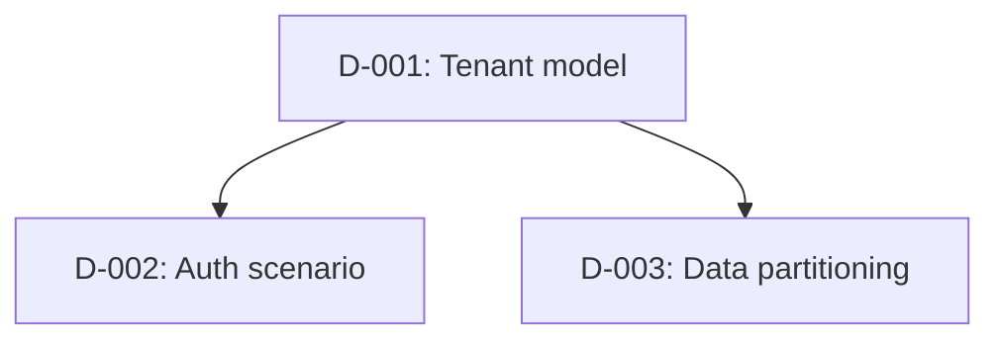

# Design Decisions - {{ProjectName}}

Record design choices made during scaffolding. Keep this file short enough that future AI sessions can load it with `HANDOFF.md` when decisions matter.

## Decision Status

Use one of: `proposed`, `confirmed`, `defaulted`, `deferred`, `superseded`.

## Decision Dependency Graph

## Decisions

| ID | Branch | Decision | Selected Option | Depends On | Status | Rationale | Affects |
|---|---|---|---|---|---|---|---|
| D-001 | Purpose | _Decision being made._ | _Chosen option._ | none | confirmed | _Why this choice fits._ | Phase 1, Phase 2 |

## Deferred Decisions

| ID | Revisit In | Blocking? | Needed Before | Notes |
|---|---|---|---|---|
| D-### | Phase 5f | no | Auth finalization | _What remains unresolved._ |

## Superseded Decisions

| ID | Superseded By | Reason |
|---|---|---|
| D-### | D-### | _What changed._ |

## Dependency Checklist

- [ ] Tenant model closed before auth/resource partitioning.
- [ ] Entity ownership closed before storage mapping.
- [ ] Lifecycle states closed before events/scheduler/notifications.
- [ ] Compliance classification closed before audit/retention/encryption/IaC.
- [ ] External dependency modes closed before local boot strategy.
- [ ] UI/API client needs closed before endpoint contract generation.
