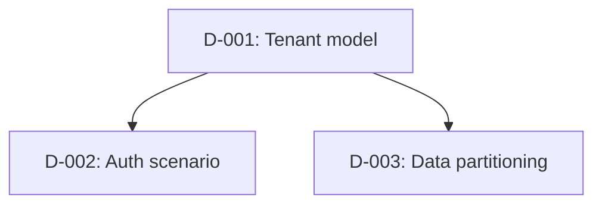

# Design Decisions - {{ProjectName}}

Record design choices made during scaffolding. Keep this file short enough that future AI sessions can load it with `HANDOFF.md` when decisions matter.

## Decision Status

Use one of: `proposed`, `confirmed`, `defaulted`, `deferred`, `superseded`.

## Record A Decision When

Record a decision only when one of these is true:

- It is hard to reverse after code generation.
- It would surprise a future maintainer without context.
- There was a real tradeoff between viable options.
- It affects resource mapping, contracts, tests, auth, tenancy, hosting, package strategy, or external dependencies.

Do not record obvious facts already covered by `.scaffold/domain-specification.yaml` or `.scaffold/resource-implementation.yaml`.

## Decision Dependency Graph

## Decisions

| ID | Branch | Decision | Selected Option | Depends On | Status | Rationale | Affects |
|---|---|---|---|---|---|---|---|
| D-001 | Purpose | _Decision being made._ | _Chosen option._ | none | confirmed | _Why this choice fits._ | Phase 1, Phase 2 |

## Deferred Decisions

| ID | Revisit In | Blocking? | Needed Before | Notes |
|---|---|---|---|---|
| D-### | Phase 5e | no | Auth finalization | _What remains unresolved._ |

## Open Question Markers

Use `[OPEN QUESTION: <single-sentence question>]` inline anywhere in this file (or in `.scaffold/domain-specification.yaml` / `.scaffold/UBIQUITOUS-LANGUAGE.md`) when an ambiguity does not yet resolve to a decision (**GR-10**). Mirror each marker in `HANDOFF.md` section Open Questions. Resolve, downgrade to a deferred decision with `Needed Before`, or remove the marker before the next phase gate.

## Assumptions

Use this table for assumptions that were accepted, corrected, or deferred during Phase 1 or brownfield adoption.

| ID | Assumption | Evidence | Risk If Wrong | Confidence | Outcome |
|---|---|---|---|---|---|
| A-### | _What was inferred._ | _User answer or file:line._ | _What would break._ | medium | confirmed |

## Superseded Decisions

| ID | Superseded By | Reason |
|---|---|---|
| D-### | D-### | _What changed._ |

## Dependency Checklist

- [ ] Tenant model closed before auth/resource partitioning.
- [ ] Entity ownership closed before storage mapping.
- [ ] Lifecycle states closed before events/scheduler/notifications.
- [ ] Compliance classification closed before audit/retention/encryption/IaC.
- [ ] External dependency modes closed before local boot strategy.
- [ ] UI/API client needs closed before endpoint contract generation.
